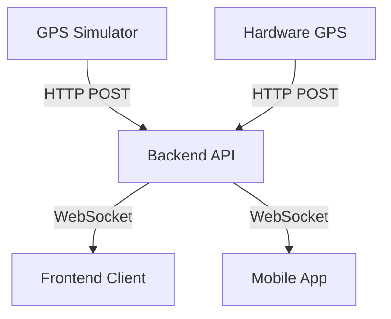

# TrackNGo - Project Documentation

**Secure Real-Time Bus Tracking System for Thanjavur Region**

This document provides a comprehensive technical overview of the TrackNGo system, including its architecture, components, setup instructions, and operational guides.

---

## 1. Project Overview

TrackNGo is a real-time bus tracking application designed to monitor public transit buses in the Thanjavur district. It visualizes moving buses on a Google Map, provides ETA updates, and displays active routes.

The system is built with a **security-first** approach, ensuring no raw GPS streams are exposed directly to the client. It uses a centralized backend to sanitize and broadcast location data via WebSockets.

### Key Features
- 📍 **Real-Time Tracking**: Live visualization of bus locations.
- 🔄 **WebSocket Broadcasting**: Low-latency updates using WebSockets.
- 🗺️ **Google Maps Integration**: Custom markers, route polylines, and geofencing.
- 🤖 **GPS Simulation**: Standalone simulator to mimic hardware GPS devices.
- 📱 **Responsive Design**: Mobile-friendly UI using Tailwind CSS.

---

## 2. System Architecture

The project consists of three distinct, loosely coupled components:



### Components

1.  **Frontend (`/`)**: A React Single Page Application (SPA) that displays the map and bus data.
2.  **Backend (`/backend`)**: A Node.js/Express server that acts as the source of truth. It receives GPS updates via REST API and broadcasts them via WebSocket.
3.  **GPS Simulator (`/gps-simulator`)**: A Node.js script that generates realistic, route-based mock GPS data to simulate moving buses.

---

## 3. Component Details

### A. Frontend Application
**Location**: Root Directory (`d:\TrackNGo\`)
**Tech Stack**: React 18, Vite, Tailwind CSS, Google Maps JS API.

#### Key Directories
- `src/components/`: UI Components (MapView, Sidebar, BusMarker).
- `src/contexts/`: State management (BusTrackingContext).
- `src/hooks/`: Custom hooks for Maps and WebSocket logic.
- `src/services/`: WebSocket service abstraction.

#### Configuration
Environment variables in `.env`:
```env
VITE_GOOGLE_MAPS_API_KEY=your_key_here
VITE_WS_URL=ws://localhost:8080/ws/live
```

---

### B. Backend Server
**Location**: `/backend`
**Tech Stack**: Node.js, Express, `ws` (WebSocket library).

#### Responsibilities
1.  **Ingest** GPS data via `POST /api/gps/update`.
2.  **Validate** coordinates (bounds checking for Thanjavur).
3.  **Broadcast** updates to connected WebSocket clients.
4.  **Rate Limit** incoming API requests.

#### API Endpoints
| Method | Endpoint | Description |
| :--- | :--- | :--- |
| `POST` | `/api/gps/update` | Receives GPS payload from hardware/simulator. |
| `GET` | `/api/gps/stats` | Returns processing statistics. |

#### WebSocket Protocol
- **URL**: `ws://localhost:8080/ws/live`
- **Server -> Client Messages**:
    - `BUS_UPDATE`: Single bus location update.
    - `CURRENT_BUS_DATA`: Initial snapshot of all active buses.

---

### C. GPS Simulator
**Location**: `/gps-simulator`
**Tech Stack**: Node.js (Standalone), Axios.

#### Purpose
Simulates physical GPS hardware installed in buses. It moves "virtual buses" along predefined lat/lng paths.

#### Features
- **Route-Based**: Follows actual road coordinates (Polyline).
- **Looping**: Automatically loops tracks when finished.
- **Robust**: Auto-retries if the backend is down.

#### Configuration (`simulator.js`)
Modify the `BUSES` array to add more simulated vehicles:
```javascript
const BUSES = [
  { bus_id: 'TN-THJ-23', route_id: 'R12', speed_base: 35 },
  // Add more...
];
```

---

## 4. Operational Guide (How to Run)

To run the complete system, you need **three separate terminal instances**.

### Step 1: Start the Backend
The backend is the brain of the operation. It must run first.

```bash
cd backend
npm install  # First time only
npm start
```
*Output: `Server running on port 8080` & `WebSocket server initialized...`*

### Step 2: Start the Frontend
The user interface to visualize the data.

```bash
# New Terminal (Root Directory)
npm install  # First time only
npm run dev
```
*Output: `Vite v5.0.8 ready in 250 ms` -> Open `http://localhost:5173`*

### Step 3: Start the GPS Simulator
Sends data to the backend so you have something to see.

```bash
# New Terminal
cd gps-simulator
npm install  # First time only
npm start
```
*Output: `✅ Sent TN-THJ-23 @ [10.7869, 79.1378]...`*

---

## 5. Troubleshooting

### ❌ Map is blank / "Loading map..."
- **Cause**: Google Maps API Key is missing or invalid.
- **Fix**: Check root `.env` file. Ensure `VITE_GOOGLE_MAPS_API_KEY` is set.
- **Console Check**: Look for `Google Maps JavaScript API error` in browser console (F12).

### ❌ Buses not moving
- **Cause**: Simulator is not running or Backend is down.
- **Fix**: Check the terminals. Ensure the Simulator is printing "✅ Sent..." and Backend is running.

### ❌ "WebSocket connection error"
- **Cause**: Frontend cannot connect to Backend.
- **Fix**:
    1. Ensure Backend is running on port 8080.
    2. Check Frontend `.env`: `VITE_WS_URL=ws://localhost:8080/ws/live` (Note the `/ws/live` path).

---

## 6. Developer Notes

- **Adding Routes**:
    1. Update `backend/src/utils/validation.js` (optional validation).
    2. Update `src/data/mockRoutes.js` (Frontend visualization).
    3. Update `gps-simulator/routes.js` (Simulation path).
    
- **Security**:
    - The simulation uses HTTP. For production, switch `API_URL` to `https://...`.
    - Backend implements rate limiting; adjust in `backend/src/utils/validation.js` if necessary.

---
*Generated by Antigravity*
